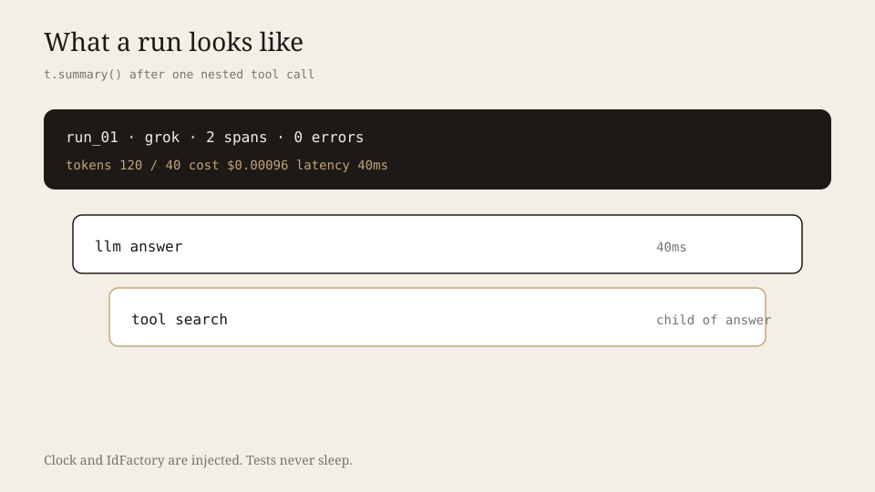
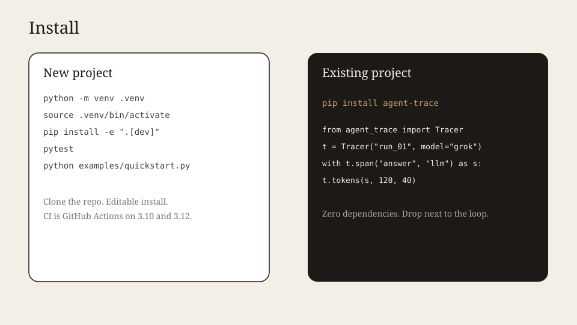

# agent-trace

Zero-dependency tracer for LLM agents. Nested spans, tool names, tokens, estimated USD.

**Live:** [github.com/vk-ai/agent-trace](https://github.com/vk-ai/agent-trace)



## Why this exists

LangSmith, Phoenix, and OpenTelemetry SDKs are products. This is a **120-line contract** you can read in one sitting. Inject a clock in tests. Export JSON. No vendor, no daemon.

| | agent-trace | Typical stacks |
|---|---|---|
| Dependencies | 0 | OTel + exporter + vendor SDK |
| Testable | `Clock` + `IdFactory` protocols | Real time, flaky |
| Shape | One `Tracer` per run | Global processors |
| Cost | Tokens × your rates | Dashboard, later |

Design: **dependency injection** (clock, ids), **context manager** spans, **ContextVar** for parent/child without passing ids, frozen-friendly `Span` dataclass.

## Install — new project



```bash
git clone https://github.com/vk-ai/agent-trace.git
cd agent-trace
python -m venv .venv && source .venv/bin/activate
pip install -e ".[dev]"
pytest
python examples/quickstart.py
```

## Install — existing project

```bash
pip install agent-trace
```

```python
from agent_trace import Tracer

t = Tracer("run_01", model="grok", usd_per_1k_in=0.003, usd_per_1k_out=0.015)
with t.span("answer", "llm") as span:
    t.tokens(span, 120, 40)
    with t.span("search", "tool", tool="web"):
        pass
print(t.summary())
```

## Stop runaways before they spend

Tracing records cost after the fact. Attach a **Budget** so the next LLM/tool
call is refused *before* the side effect:

```python
from agent_trace import Budget, BudgetExceeded, Tracer

t = Tracer(
    "run_01",
    model="grok",
    usd_per_1k_in=0.003,
    usd_per_1k_out=0.015,
    budget=Budget(
        max_tokens=8_000,
        max_cost_usd=0.05,
        max_steps=12,
        allowed_tools=frozenset({"web", "retriever"}),
    ),
)

with t.span("answer", "llm") as span:
    t.reserve_tokens(120, 40)          # gate tokens + implied USD first
    # ... call the model ...
    t.tokens(span, 120, 40)            # record usage on the span

try:
    with t.span("hack", "tool", tool="shell"):
        pass
except BudgetExceeded as exc:
    print(exc.reason, exc.requested)   # tool / shell
```

`reserve_tokens` / `authorize_tool` / step checks are atomic: a rejected call
does not mutate the gate. `t.summary()["budget"]` shows limits and consumption.
Standalone `BudgetGate` works without a Tracer when you only need policy.

## What it looks like

`t.summary()` prints:

```
{'run_id': 'run_01', 'model': 'grok', 'spans': 2, 'errors': 0,
 'tokens_in': 120, 'tokens_out': 40, 'cost_usd': 0.00096, 'latency_ms': 40.0}
```

Errors are recorded on the span and re-raised. Tests never sleep — they inject a fake clock.

MIT. Python 3.10+. CI on 3.10 and 3.12.
